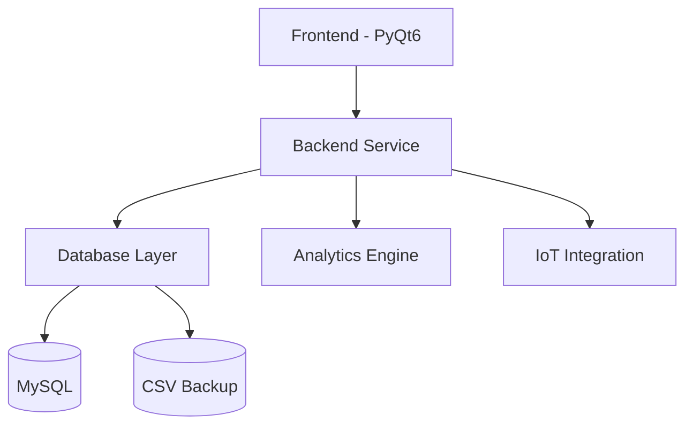

# Sistema de Gestión de Máquinas 🚀
<div align="center">
  

  [](https://www.python.org)
  [](https://www.mysql.com)
  [](https://www.qt.io)
  [](LICENSE)
</div>

<p align="center">
  <b>Una solución empresarial moderna para la gestión inteligente de equipos y recursos</b>
</p>

---

## 🌟 Características Destacadas

<div align="center">
  <table>
    <tr>
      <td align="center">
        
        <br />
        <b>Dashboard Inteligente</b>
      </td>
      <td align="center">
        
        <br />
        <b>Análisis Predictivo</b>
      </td>
      <td align="center">
        
        <br />
        <b>Gestión QR</b>
      </td>
      <td align="center">
        
        <br />
        <b>Seguridad Avanzada</b>
      </td>
    </tr>
  </table>
</div>

### 🎯 Gestión de Inventario
- 📊 **Monitoreo en Tiempo Real**
  - Estado actual de dispositivos
  - Ubicación en tiempo real
  - Historial de movimientos

- 📱 **Sistema QR Integrado**
  - Generación automática de códigos
  - Escaneo rápido para préstamos
  - Seguimiento simplificado

### 🔄 Sistema de Préstamos
- 🎯 **Proceso Optimizado**
  ```mermaid
  graph LR
    A[Solicitud] --> B[Aprobación]
    B --> C[Préstamo]
    C --> D[Seguimiento]
    D --> E[Devolución]
  ```

### 📈 Analytics & Reportes
- 🧠 **IA Predictiva**
- 📊 **Dashboards Personalizables**
- 📑 **Reportes Automatizados**

---

## 🚀 Instalación Rápida

```bash
# Clonar repositorio
git clone https://github.com/usuario/sistema-gestion-maquinas.git

# Instalar dependencias
pip install -r requirements.txt

# Iniciar aplicación
python main.py
```

<details>
<summary>📋 Requisitos Detallados</summary>

### Hardware Recomendado
- 💻 **CPU**: Intel Core i5+
- 🧠 **RAM**: 8GB+
- 💾 **Almacenamiento**: 500MB+

### Software Necesario
- 🖥️ Windows 10/11
- 🐍 Python 3.8+
- 🗄️ MySQL 8.0+

</details>

---

## 🎨 Interfaz Moderna

<div align="center">
  
</div>

### 🎯 Características de UI/UX
- 🌓 Modo Claro/Oscuro
- 📱 Diseño Responsive
- 🎨 Temas Personalizables

---

## 🛠️ Arquitectura



---

## 📚 Guías y Documentación

<div align="center">
  <table>
    <tr>
      <td align="center">
        <a href="docs/user-guide.md">
          📘 Guía de Usuario
        </a>
      </td>
      <td align="center">
        <a href="docs/admin-guide.md">
          📗 Manual Admin
        </a>
      </td>
      <td align="center">
        <a href="docs/api-docs.md">
          📙 API Reference
        </a>
      </td>
    </tr>
  </table>
</div>

---

## 🤝 Soporte & Comunidad

<div align="center">
  <a href="mailto:soporte@puntoticket.com">
    
  </a>
  <a href="https://soporte.puntoticket.com">
    
  </a>
</div>

---

## 📜 Licencia

<div align="center">
  
  MIT © [2025] [Punto Ticket]
  
  Desarrollado con ❤️ por el equipo de Punto Ticket
</div>

---

<div align="center">
  
</div>
